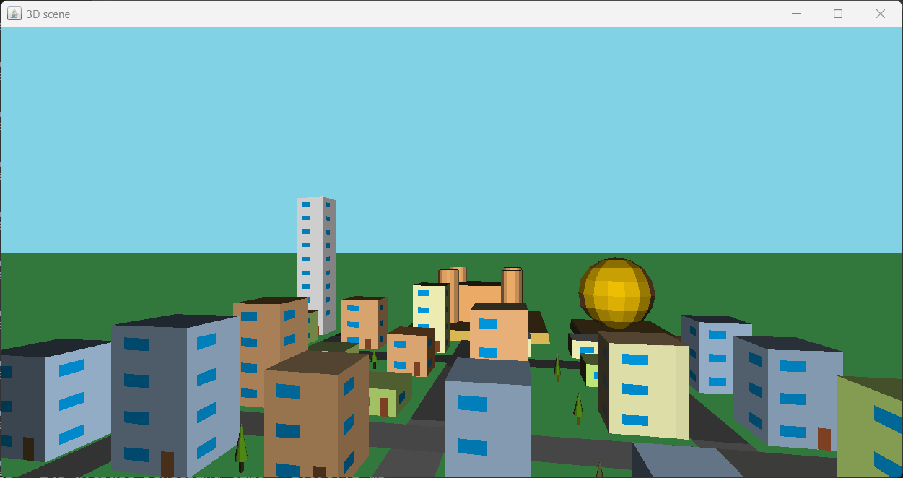
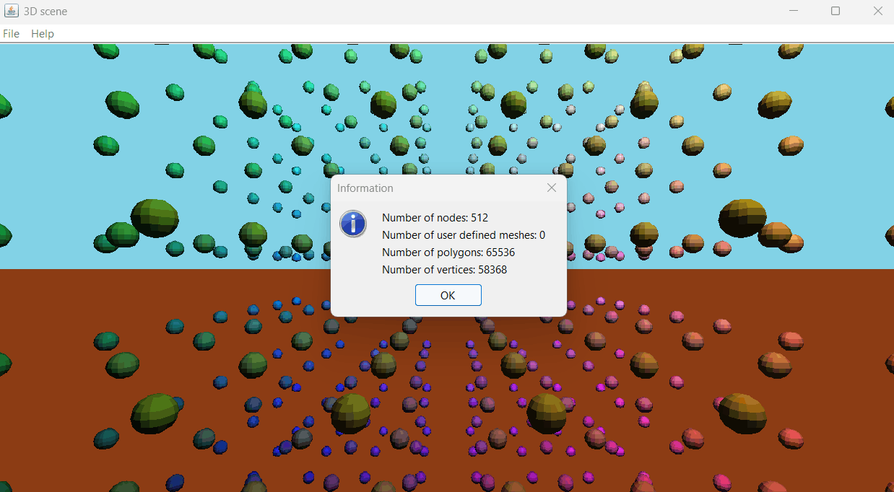
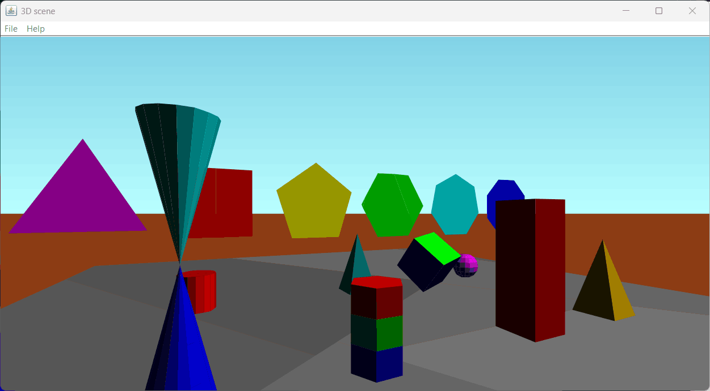

Simple 3D Graphic Engine
========================
Java package 'simple3D' implements a simple software 3D renderer, ideal for low-poly rendering.

This package, 100% java, can be used togheter with AWT/Swing/JavaFX/Android or other Java graphic environments as it does not have any specific dependency.

Features
========
♦ Simple yet flexible data model based on nodes and meshes \
♦ Binary Space Partitioning for fast rendering \
♦ Perspective projection with basic flat shading \
♦ Read and write scene on filesystem using JSON data format

Rendering example
=================


Work flow
=========
1) Prepare the scene by creating meshes and nodes. Nodes are the objects to be rendered and meshes are pure geometric entities used as template. Nodes can also use buildin meshes, called shapes like "sphere", "cube".
2) Setup the scene by building the Binary Space Partitioning tree. The BSP enables fast rendering of the 3D scene.
3) Render the scene on screen in a continuous loop.

Classes and packages
====================
```
simple3d      -- 3d graphic engine
  Engine3D    -- Main class, the engine itself
  BSPNode     -- Binary Space Partitioning tree builder
  Node        -- Object to be rendered
  Mesh        -- Mesh is a collection of polygons
  Polygon3D   -- 3D polygon with optional color
  Light3D     -- Light source
  Matrix4x4, Vector3D, Polyface3D, Dumpable, Color -- Utility classes
json          -- Light and fast JSON library
```

Interactive demo
================

The class Scene3D implements basic interactive demo of the features built in simple3d engine.
Keyboard controls for camera movement using arrows(up/down/left/right) and shift key are included.
Shift + up arrow: move camera higher; Shift + down arrow: move camera lower
Shift + right arrow: rotate camera right; Shift + left arrow: rotate camera left

Compile:
```
javac Scene3D.java
```

Run:
```
java Scene3D [filename]
```

Some samples:
```
java Scene3D 512-spheres.gz     -- 512 colored tests, 65K polygons
java Scene3D town.json.gz       -- a small town with a castle
java Scene3D castles.json.gz    -- two castles
java Scene3D pyramids.json.gz   -- two mayan pyramids
```

Usage
=====
The application has to instantiate the Engine3D, set-up light and camera position, sky and ground colors, build nodes and optionally meshes.
To learn how to use the simple3d engine look at Scene3D.java demo application.
```
Engine3D engine = new Engine3D(false);
engine.setLight(new Light3D(new simple3d.Color(255, 255, 255), 10, 20, -10));
engine.setCameraPos(new Vector3D(0, 1.7, -10));
```
The scene is described by nodes and meshes. Nodes are the objects to be rendered and hold the transformation, color and reference info to a mesh.
Meshes are geometric structure of a 3D object composed of vertices (points) and faces (polygons) that define the object's surface shape.
There are also built-in meshes called shapes that don't have to be defined, but are ready for use.
In the following example a pyramid is added to the scene, performing both a scaling and a translation.
```
Node pyramid = new Node("pyr1", Mesh.Shape.pyramid, simple3d.Color.parse("#009090"));
pyramid.applyScale(1, 2, 1);
pyramid.applyTranslation(0, 0, 5);
sceneNodes.add(pyramid);
```
After the preparation of the scene, the Engine3D has to be setup to build BSP.
```
engine.setupScene(FOV, ASPECT_RATIO);
```

The rendering process is performed by invoking engine.render3D().
```
engine.render3D(cameraYaw, getWidth(), getHeight(), (projectedVertices, color) -> {
	screenPoly.reset();
	for (Vector3D v : projectedVertices)
		screenPoly.addPoint((int) v.x, (int) v.y);
	g.setColor(new java.awt.Color(color.getRed(), color.getGreen(), color.getBlue()));
	g.fillPolygon(screenPoly);
});
```

File Format
===========
The JSON format for the simple 3D files is described in [simple3D_json.txt](simple3D_json.txt)

Limitations of current release compared to version 1 of 3dscene_json.txt:
- parameter "source" to import library file is not implemented. *TODO*
- in case of malformed json content the behavior of the application is unspecified. *TODO*


Other screenshots
=================



